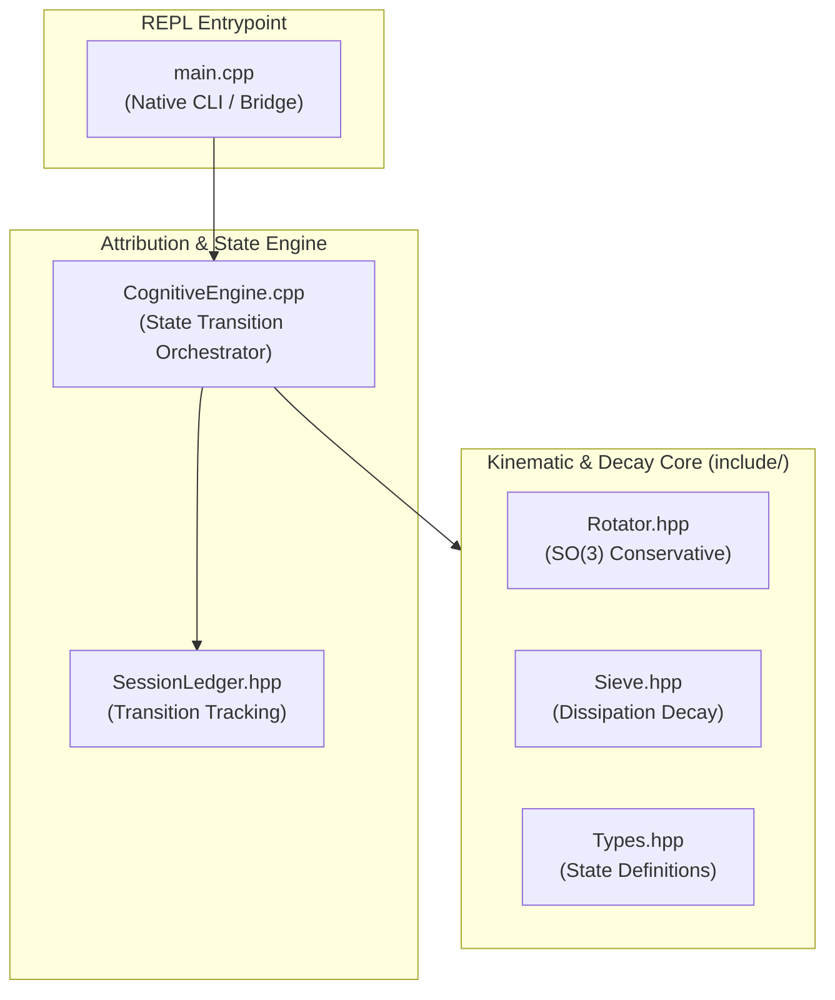

```markdown
# CognitiveEngine Bridge (Project1)

[](https://en.cppreference.com/w/cpp/20)
[](https://gcc.gnu.org/)
[]()
[](https://llvm.org/)

A deterministic C++20 kinematic execution engine and interactive REPL bridge featuring conservative kinematic rotations, hyperbolic dissipation decay, and state session tracking.

---

## 1. System Architecture



### Directory Layout

```text
.
├── CognitiveEngine.h          # Core interface declaration
├── CognitiveEngine.cpp        # State transition orchestrator implementation
├── include/
│   ├── Rotator.hpp            # SO(3) conservative kinematic rotation
│   ├── SessionLedger.hpp      # Transition tracking and attribution records
│   ├── Sieve.hpp              # Non-linear hyperbolic dissipation decay
│   └── Types.hpp              # Foundational state coordinate definitions
└── src/
    └── main.cpp               # Native interactive REPL driver

```

---

## 2. Quick Start & Execution

> [!IMPORTANT]
> **Compiler Contract**: Requires GCC 13+ or Clang 16+ targeting `-std=c++20`. Relies fundamentally on `<numbers>`, concepts, and structured bindings.

### Build & Run

```bash
# Build the unified bridge executable
g++ -std=c++20 -Wall -Wextra -Werror -Iinclude CognitiveEngine.cpp main.cpp -o cognitive_engine_bridge

# Execute interactive REPL driver
./cognitive_engine_bridge

```

---

## 3. Verification & Diagnostic Manual

Follow this matrix to verify structural compliance, enforce formatting standards, and ensure invariant preservation across runtime passes.

### Verification Matrix

| Layer | Tool | Target Domain | Command | Invariant / Pass Criteria |
| --- | --- | --- | --- | --- |
| **Static** | `clang-tidy` | Modern C++20 / Bugs | `clang-tidy CognitiveEngine.cpp main.cpp -- -std=c++20 -Iinclude` | Zero warnings from `bugprone`, `modernize`, or `analyzer` |
| **Static** | `cppcheck` | Memory / Null Pointer | `cppcheck --enable=all --inconclusive --std=c++20 -I include .` | Zero uninitialized values or out-of-scope references |
| **Style** | `clang-format` | LLVM Layout Compliance | `clang-format --dry-run -Werror -style=LLVM *.cpp include/*.hpp` | Clean zero-diff exit code |
| **Dynamic** | `ASan / LSan` | Heap / Pointer Lifetimes | `g++ -std=c++20 -fsanitize=address,leak -g -Iinclude ...` | Zero leak or use-after-free aborts across full lifecycle |
| **Dynamic** | `UBSan` | Undefined Operations | `g++ -std=c++20 -fsanitize=undefined -g -Iinclude ...` | Zero arithmetic overflows or unaligned trap signals |

```bash
sudo apt-get update && sudo apt-get install -y \
  clang-tidy \
  cppcheck \
  clang-format \
  graphviz \
  build-essential

```

---

### Static Analysis & Linting

#### Modern C++ Linting (`clang-tidy`)

Detect modernize opportunities, bug-prone constructs, and performance bottlenecks:

```bash
clang-tidy CognitiveEngine.cpp main.cpp -- -std=c++20 -Iinclude \
  -checks="bugprone-*,performance-*,readability-*,modernize-*,clang-analyzer-*"

```

#### Flaw Detection (`cppcheck`)

Scan the repository tree for uninitialized values, out-of-scope references, and null pointer dereferences:

```bash
cppcheck --enable=all --inconclusive --std=c++20 --suppress=missingIncludeSystem -I include .

```

#### Style Enforcement (`clang-format`)

Validate code indentation, brace placement, and pointer alignments against the LLVM style guide:

```bash
# Verify style compliance without modifying files:
clang-format --dry-run -Werror -style=LLVM CognitiveEngine.h CognitiveEngine.cpp main.cpp

# Auto-format in place:
clang-format -i -style=LLVM CognitiveEngine.h CognitiveEngine.cpp main.cpp

```

---

### Dynamic Sanitizers & Runtime Instrumentation

Run dynamic instrumentation to guarantee invariant preservation, zero-leak heap execution, and deterministic memory teardown.

#### Address & Leak Sanitizer (`ASan` / `LSan`)

Traps heap overflows, use-after-free, stack-buffer corruption, and memory allocation leaks:

```bash
# Compile with ASan + LSan instrumentation
g++ -std=c++20 -fsanitize=address,leak -g -Iinclude CognitiveEngine.cpp main.cpp -o asan_test

# Execute test run
./asan_test

```

> [!NOTE]
> **Pass Invariant**: The binary must complete state initialization, rotation/decay mutation passes, and teardown with zero ASan crash reports or leak allocations.

#### Undefined Behavior Sanitizer (`UBSan`)

Intercepts integer overflow, division by zero, unaligned memory accesses, and null pointer dereferences:

```bash
# Compile with UBSan instrumentation
g++ -std=c++20 -fsanitize=undefined -g -Iinclude CognitiveEngine.cpp main.cpp -o ubsan_test

# Execute runtime verification
./ubsan_test

```

> [!NOTE]
> **Pass Invariant**: Full execution cycle completes with zero UBSan runtime trap signals or warnings.

```

```
